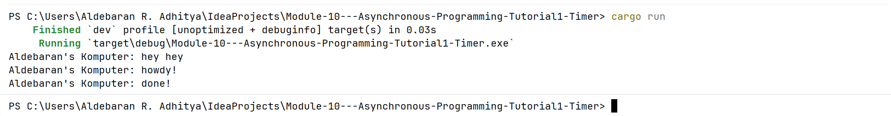

# Module 10: Asynchronous Programming

## Screenshot(s) from "Experiment 1.2: Understanding how it works." commit

The reason `"Aldebaran's Komputer: hey hey"` is printed before the asynchronous block's contents is rooted in the lazy evaluation and single-threaded task scheduling model of Rust's async runtime. 
In Rust, defining an async block or calling a future does not immediately trigger its execution because futures remain completely lazy until they are actively driven to completion by an executor. 
When `spawner.spawn` is called, it packages the async block into a Task structure and enqueues it onto a multi-producer, single-consumer synchronous channel. 
Because this task is placed on a queue, the main thread remains unblocked and continues executing its synchronous expressions sequentially, leading it to process the `println!("Aldebaran's Komputer: hey hey");` statement. 
The code within the spawned task remains entirely dormant until the main thread subsequently completes its initial synchronous flow and explicitly calls `executor.run()`. 
Once this executor loop takes control, it pulls tasks out of the channel queue and invokes their respective `.poll()` methods. 
This drives the execution of the asynchronous code block, which outputs `"howdy!"`, yields control back to the thread during the 2-second TimerFuture suspension, and ultimately resumes to conclude with `"done!"`
