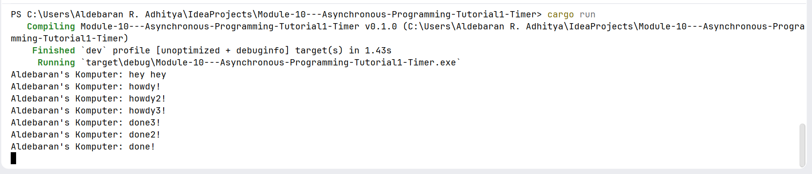
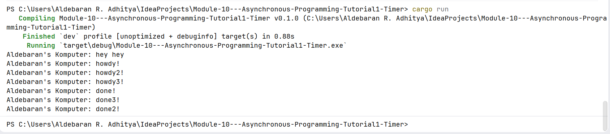

# Module 10: Asynchronous Programming

## Tutorial 1: Timer

### Screenshot(s) from "Experiment 1.2: Understanding how it works." commit

The reason `"Aldebaran's Komputer: hey hey"` is printed before the asynchronous block's contents is rooted in the lazy evaluation and single-threaded task scheduling model of Rust's async runtime. 
In Rust, defining an async block or calling a future does not immediately trigger its execution because futures remain completely lazy until they are actively driven to completion by an executor. 
When `spawner.spawn` is called, it packages the async block into a Task structure and enqueues it onto a multi-producer, single-consumer synchronous channel. 
Because this task is placed on a queue, the main thread remains unblocked and continues executing its synchronous expressions sequentially, leading it to process the `println!("Aldebaran's Komputer: hey hey");` statement. 
The code within the spawned task remains entirely dormant until the main thread subsequently completes its initial synchronous flow and explicitly calls `executor.run()`. 
Once this executor loop takes control, it pulls tasks out of the channel queue and invokes their respective `.poll()` methods. 
This drives the execution of the asynchronous code block, which outputs `"howdy!"`, yields control back to the thread during the 2-second TimerFuture suspension, and ultimately resumes to conclude with `"done!"`

### Screenshot(s) from "Experiment 1.3: Multiple Spawn and removing drop" commit

Note: A screenshot of my terminal when `drop(spawner);` is commented (not run)

Note: A screenshot of my terminal when `drop(spawner);` is not commented (run)

When multiplying the asynchronous task declarations, running the program reveals that multiple futures are processed concurrently as the single-threaded executor interleaves tasks whenever they hit an asynchronous suspension boundary. 
While the tasks are pulled out of the channel queue and initialized sequentially, the completion messages `"done!"` exhibit a shifting, non-deterministic ordering across different execution runs. 
This behaviour happens because each TimerFuture instance spins up an independent background Operating System thread to sleep for the designated two seconds. 
Since all three threads sleep for the exact same duration, they wake up almost simultaneously and enter a race condition to acquire their respective Mutex locks and push themselves back onto the executor's channel. 
The exact order in which these completion logs appear in the terminal is completely dependent on the OS thread scheduler's micro-adjustments and background CPU load at that precise microsecond.
Beyond task interleaving, the presence or absence of the `drop(spawner);` statement determines whether the application can gracefully terminate or remain deadlocked in the terminal. 
The internal runtime execution method `executor.run()` relies on a continuous channel-receiving loop that blocks the main thread and awaits incoming tasks as long as at least one active Sender instance remains alive in the system. 
If `drop(spawner);` is omitted, the original spawner instance in the main function is never deallocated, signaling to the channel's receiver that future tasks might still be submitted. 
This prevents the channel from returning a disconnected error state even after all three active futures have fully completed their work which causes the receiver loop to hang indefinitely in search of non-existent payloads. 
Therefore, explicitly calling `drop(spawner);` is a structural requirement to tear down the remaining sender reference, break the execution loop, and allow the binary to naturally exit back to the command prompt once the task queue is entirely empty.
